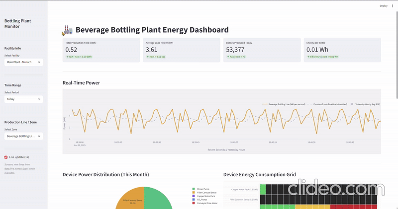

## Beverage Bottling Plant Energy Dashboard

A Streamlit-based visualization package for live and historical energy analytics of a beverage bottling line. It integrates ROS-published live data, a WebSocket bridge, and a rich dashboard for operational KPIs, device-level insights, CO₂ and cost metrics, and simple trend-based predictions.

## Overview

* Data files

  * `data/live_sensor.jsonl`: Live JSONL telemetry appended by `websocket_test.py` (one JSON per line).
  * `data/historical_months.json`: Auto-generated synthetic daily aggregates if missing.
* Apps and scripts

  * `visualization.py`: Main Streamlit dashboard (reads live JSONL or synthetic fallback).
  * `websocket_test.py`: Streamlit-based ROS WebSocket monitor; normalizes messages and appends JSONL.
  * `src/bottling_energy_sim/launch/rosbridge_websocket_launch.py`: Launch file for rosbridge_websocket (default port 9090).
  * `src/bottling_energy_sim/launch/energy_pub_launch.py`: Launch the energy publisher node.
  * `prediction.py`: Standalone next-day predictor (CSV/YAML input) using scikit-learn (not used by the dashboard).

## Features

* **Live Data Ingestion**

  * Tails `data/live_sensor.jsonl` using a file offset for rotation handling.
  * Session buffer capped (30,000 rows in the dashboard, 5,000 rows in the WebSocket monitor).
* **Synthetic Fallback**

  * `generate_bottling_plant_data()`: realistic hourly device and aggregate values when no live stream is present.
  * `historical_months.json`: created automatically with 90 days of synthetic aggregates.
* **KPIs (Top Metrics)**

  * Total Production Yield (kWh) and delta vs yesterday
  * Average Load Power (kW) with next-step prediction
  * Bottles Produced Today and next-step prediction
  * Energy per Bottle (Wh) with recent-trend prediction
* **CO₂ and Cost Block**

  * CO₂ Emissions Today with tomorrow’s predicted CO₂
  * Net Energy Cost Today and savings vs all-grid baseline
  * Predicted Net Cost Tomorrow with predicted yield split
* **Real-Time Visualization**

  * Last 120 seconds per-second power trend (kW), jitter-smoothed if flat
  * Simulated short baseline for context
  * Yesterday hourly average overlay
* **Device Visualizations**

  * Device Power Distribution (Pie) for current month
  * Device Energy Consumption Grid (Heatmap of kWh boxes with color bands)
  * Device-specific real-time line chart with area fill
* **Historical Aggregation Explorer**

  * Daily/Weekly/Monthly stacked bars for energy flows
  * Current vs Previous Month comparison
* **Alerts & Notifications**

  * Peak power detection vs a user-defined kW threshold
  * Inline alerts with time, power, and primary device contributor

## Data Model

* Core device inputs

  * `conveyor_drive_motor_kw` (kW)
  * `co2_pump_current_a` (A)
  * `rinser_pump_power_w` (W)
  * `filler_servo_energy_j` (J)
  * `capper_voltage_v` (V)
  * `anomaly_flag` (optional)
  * `timestamp` (ISO8601, injected by websocket_test.py)
* Derived per-sample aggregates (dashboard)

  * `load_power` (W): conveyor kW × 1000 + rinser W + CO₂ current × median capper voltage
  * `selfuse_energy` (kWh): 70% of base_kwh
  * `grid_consumption` (kWh): 30% of base_kwh
  * `exported_energy` (kWh): 0 (not modeled)
  * `yield_energy` (kWh): equals selfuse_energy
  * `bottles_produced` (count): proportional heuristic from load_power
* Environmental & Financial

  * CO₂ emissions (kg): grid_consumption × 0.233 kg/kWh
  * Costs: grid_rate (0.22 €/kWh), export_rate (0.08 €/kWh)

## Predictive Logic

Lightweight recent-trend projections (numpy.polyfit):

* `predict_next_recent`: next value for yield_energy, load_power, bottles_produced
* `predict_energy_per_bottle_recent`: recent Wh/bottle series with next estimate
* Daily predictions for tomorrow’s CO₂ and net cost derived from daily sums and today’s ratios

`prediction.py` provides a separate next-day regression (LinearRegression) for CSV/YAML files and renders a Matplotlib table.

## ROS/WebSocket Integration

* `rosbridge_websocket_launch.py` starts rosbridge_server’s WebSocket on port 9090.
* `websocket_test.py`:

  * Connects to `ws://localhost:9090`
  * Subscribes to `/bottling_energy` (std_msgs/msg/String)
  * Parses `msg.data` (JSON or “key: value” lines)
  * Normalizes payload, appends to `data/live_sensor.jsonl`, and buffers in Streamlit session
* `visualization.py` tails `data/live_sensor.jsonl` and updates the UI at 1 s intervals when enabled.

## File Structure

* `hackathon_ws/`

  * visualization.py
  * websocket_test.py
  * prediction.py
  * data/

    * live_sensor.jsonl
    * historical_months.json
  * src/

    * bottling_energy_sim/

      * launch/

        * rosbridge_websocket_launch.py
        * energy_pub_launch.py
      * … (publisher/simulation code)

## Running

Prerequisites (Windows + WSL):

* Python 3.10+
* `pip install streamlit plotly pandas numpy websockets scikit-learn matplotlib`
* ROS 2 with `rosbridge_server` (for live mode)

Start rosbridge :

```
ros2 launch bottling_energy_sim rosbridge_websocket_launch.py
```

Start publisher :

```
ros2 launch bottling_energy_sim energy_pub_launch.py
```

WebSocket monitor :

```
streamlit run websocket_test.py
```

Start the dashboard :

```
streamlit run visualization.py
```

Access:

* Local URL: [http://localhost:8501](http://localhost:8501)

If `data/live_sensor.jsonl` is missing or empty, the dashboard switches to synthetic demo mode.

## Demo Video

<p align="center">
  
</p>

## Configuration

* Sidebar (dashboard):

  * Facility selector
  * Time range: Today, Last 7 Days, Last 30 Days, This Month
  * Zone selector
  * Live update toggle (1 s refresh)
* Alerts:

  * “Set Power Peak Limit (kW)” in Alerts section

## Troubleshooting

* No live data in dashboard:

  * Confirm `rosbridge_websocket` is running on port 9090.
  * Run `websocket_test.py` to subscribe and write to `data/live_sensor.jsonl`.
  * Verify `/bottling_energy` publishes std_msgs/String with JSON or “key: value” lines.
* `websocket_test.py` errors:

  * Check firewall/port 9090.
  * Ensure ROS 2 `rosbridge_server` is installed and launched.
* Stale visuals:

  * Toggle “Live update (1s)” in the dashboard sidebar.
  * Confirm `data/live_sensor.jsonl` is non-empty and growing.
* Scaling/units look off:

  * Review device inputs and voltage assumptions (CO₂ current × capper_voltage_v).
  * `bottles_produced` is heuristic; adjust publisher if needed.

## License

Internal use for hackathon/demo purposes. Avoid redistribution of data without consent.


